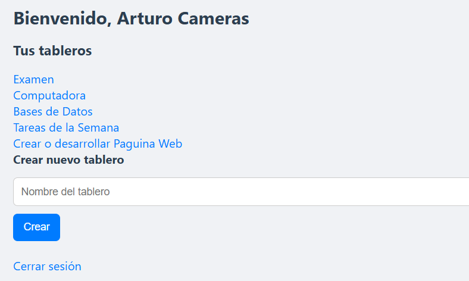

# 🌟 Sistema de Gestión de Tareas Colaborativo (Estilo Trello)

Una aplicación web sencilla y funcional para gestionar tareas en equipo, inspirada en el estilo Trello.  
Facilita la colaboración mediante **tableros**, **listas** y **tarjetas**, con opciones de registro de usuarios, asignación de tareas, comentarios y organización visual.

---

## 🚀 Características Principales

✅ Registro e inicio de sesión de usuarios  
✅ Creación de tableros por proyecto  
✅ Listas personalizadas para organizar tareas  
✅ Tarjetas con título, descripción y comentarios  
✅ Asignación de responsables  
✅ Movimiento dinámico de tarjetas entre listas  
✅ Diseño responsivo básico (HTML, CSS, JS)

---

## 🛠️ Tecnologías Utilizadas

- **Backend:** Python 3, Flask, Flask-Login, Flask-SQLAlchemy  
- **Base de datos:** SQLite  
- **Frontend:** HTML5, CSS3, JavaScript  
- **Gestión de entorno:** `requirements.txt`, entorno virtual

---

## ⚙️ Instalación y Ejecución

1. **Clona o descarga** este repositorio:

```bash
https://github.com/arturohidalgo21/Gestor-de-Tareas-Colaborativo.git
cd gestor-tareas-colaborativo
```

2. **(Opcional) Crea un entorno virtual:**

```bash
# Linux/macOS
python3 -m venv venv
source venv/bin/activate

# Windows
python -m venv venv
venv\Scripts\activate
```

3. **Instala las dependencias necesarias:**

```bash
pip install -r requirements.txt
```

4. **Ejecuta la aplicación:**

```bash
python app.py
```

5. **Abre tu navegador y entra a:**

```
http://127.0.0.1:5000/login
```

---

## 🧩 Estructura del Proyecto

```
gestor_tareas_colaborativo/
├── app.py                  # Punto de entrada principal
├── models.py               # Modelos de base de datos
├── requirements.txt        # Librerías necesarias
├── templates/              # Plantillas HTML
│   ├── login.html
│   ├── register.html
│   ├── dashboard.html
│   └── board.html
└── static/
    └── css/
        └── styles.css      # Estilos de la aplicación
```

---

## 📝 Uso Básico

1. **Regístrate** como nuevo usuario o inicia sesión.  
2. **Crea un tablero** para tu proyecto.  
3. Dentro del tablero, **añade listas** (ej. "Pendiente", "En progreso", "Completado").  
4. **Crea tarjetas** dentro de las listas con tareas específicas.  
5. **Asigna tareas**, **agrega comentarios** y **mueve las tarjetas** entre listas para reflejar el avance.

---

## 🤝 Contribuciones y Propósito

Este es un proyecto con fines educativos, desarrollado para practicar y comprender el ciclo completo de una aplicación web colaborativa usando tecnologías modernas.  
Ideal para estudiantes o desarrolladores que desean aprender sobre:

- Autenticación y sesiones en Flask  
- ORM con SQLAlchemy  
- Manejo de rutas, plantillas y formularios  
- Interacción frontend-backend con lógica sencilla  

¡Las contribuciones, sugerencias o forks son bienvenidas! 🌱

---

## 📸 Vista previa (opcional)

### 🖼️ Vista previa del sistema

<p align="center">
  
</p>

<p align="center">
  
</p>

<p align="center">
  
</p>

<p align="center">
  
</p>

---

## 🧠 Conclusión

Gracias a este proyecto, se aplican conocimientos fundamentales del desarrollo web full stack:  
Desde la **gestión de usuarios** hasta la **persistencia de datos** y el **diseño de interfaz**, demostrando que con habilidades sólidas se pueden construir herramientas útiles, escalables y listas para mejorar.

---
